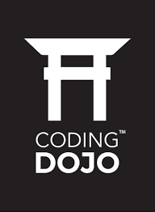

 

<h2>Bootcamp Data Science    Junio 2023 </h2>
<b>Instructor Principal:</b> Francisco Alfaro  
<b>Instructor Asistente:</b> Jesus Ortiz    

# **Bienvienidos a Coding Dojo**

En este bootcamp te sumerges en los fundamentos del Data Science y el Machine Learning en Python. Lograrás una comprensión integral de todo el proceso de Data Science: preparación de datos, análisis y la visualización de datos, además de cómo aplicar correctamente los algoritmos de Machine Learning a diversas tareas.

¡Te graduarás con una cartera de proyectos que demostrarán tu perspicacia en Data Science a tus futuros empleadores!

> **Nota**: Para mayor información del bootcamp, consultar el siguiente [link](https://www.codingdojo.la/data-science/).
